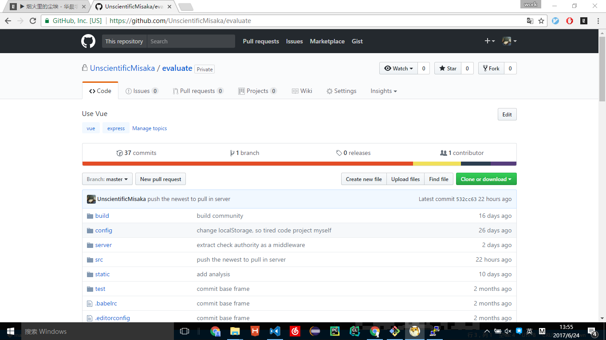
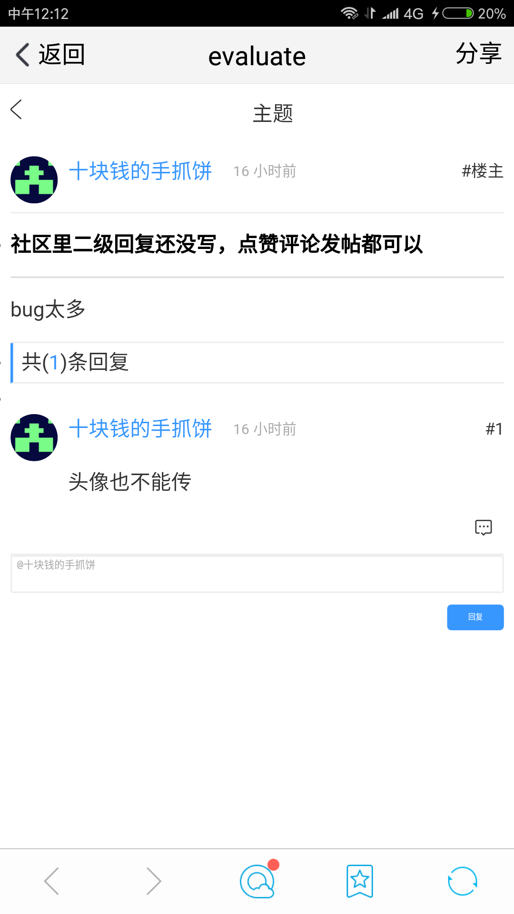
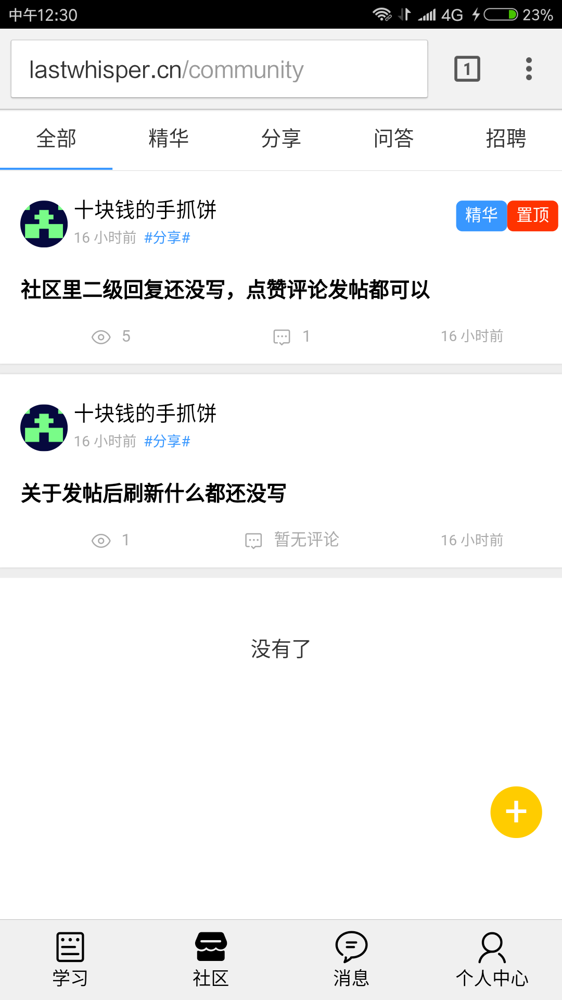
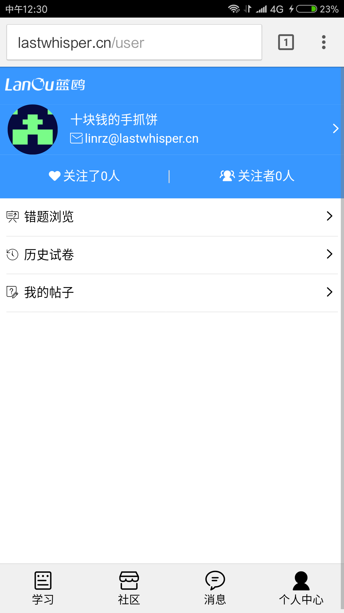
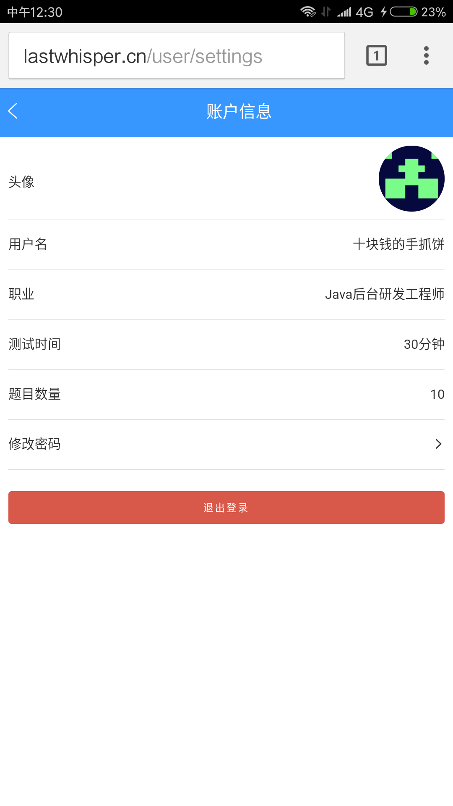
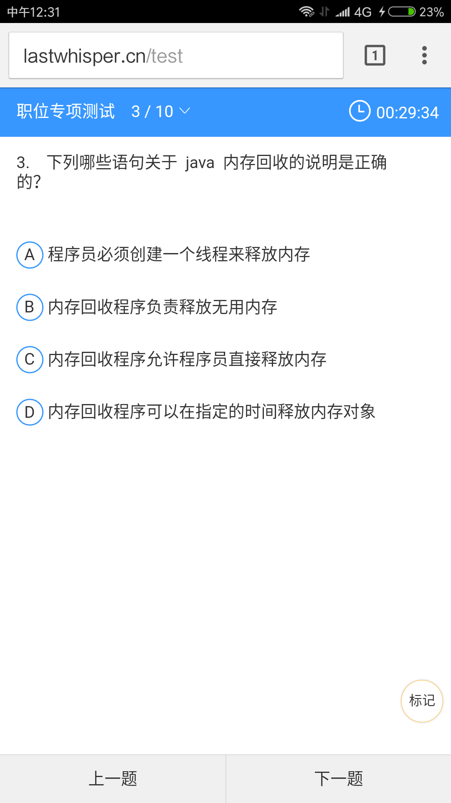
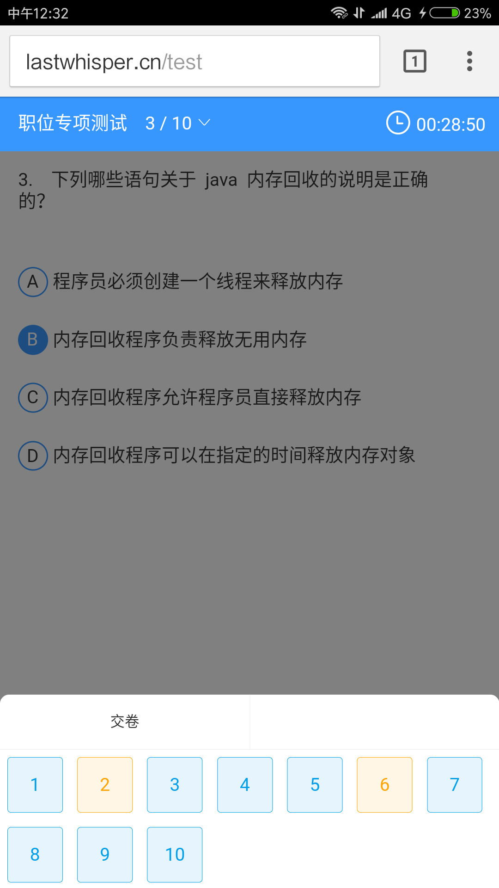
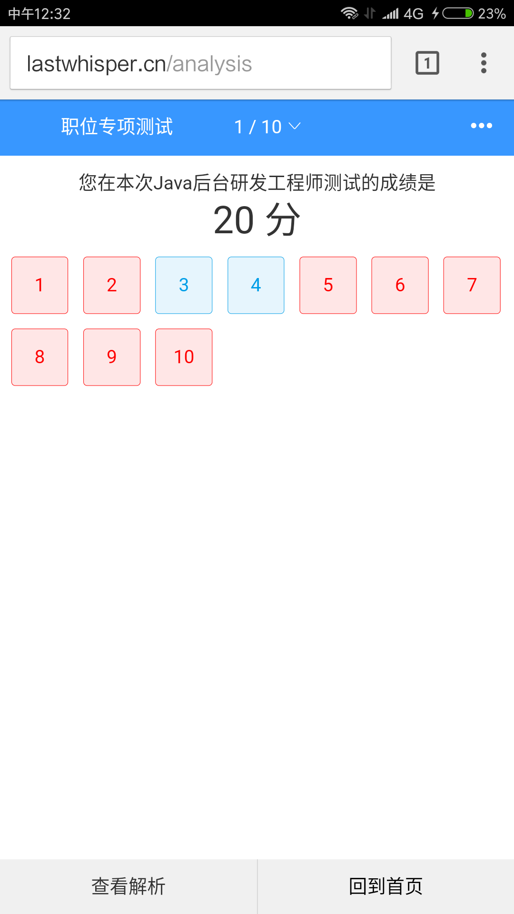
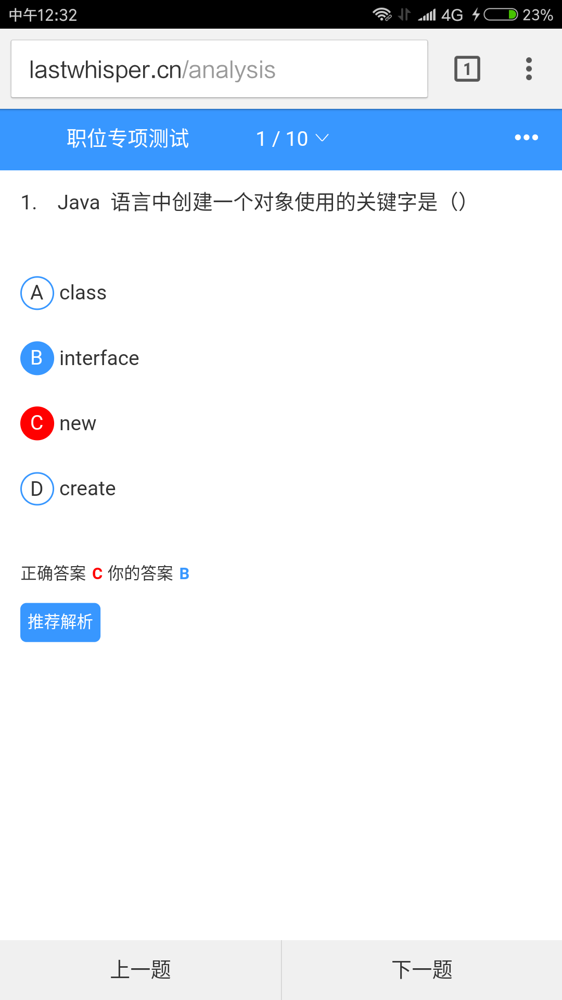

# Evaluate
这个项目参与了全国第八届大学生服务外包竞赛，虽然我觉得我现阶段写的代码并不值钱，但在github上一搜蓝鸥IT教育考评系统，还真有人放在了github上协作开发，啊喂，这属于考试泄答案啊。而且说是组队，实际上只有我一个人独自敲代码，所以就放在了私人仓库里。  

## Technology Stack
Vue2.0 + Vue-router + Vuex + axios + Stylus  
Express + mongodb + redis(暂时还没写到缓存)

## 线上地址
方便调试没build打包发布，仍然是开发模式，首屏时间超长的哇，自己都忍受不了，想写用到用户功能时再登录，但题目要求要先登录注册，体验对用户很不友好。  

<b>免注册测试账号: 1@qq.com</b>  
<b>密码： 123  </b>  

#### 施工现场，bug超级多，尤其是做题目那块排版混乱，数据从题库网站上爬下来没有整理格式，这两星期期末考试，交各种实验报告，还有课程设计，这阵子结束再腾时间修改。顺带把简单的扒牛客网的小爬虫也放在了github上，[请戳我](https://github.com/UnscientificMisaka/Spider)

[一些关于本项目的开始，反思，请戳这里](http://linrz.me/2017/06/21/node/)

[线上运行地址http://lastwhisper.cn/login](http://lastwhisper.cn/login)  
请以chrome手机模式运行，没写resize事件,需要手动刷新一下根据设备dpi重新布局  
手机扫一扫  

## ScreenShots

## Todo
* [x] 登录/注册/忘记密码
* [x] 邮件激活
* [x] 个人设置
* [x] 根据职业组卷
* [x] 发题
* [x] 交卷
* [x] 分析
* [x] 社区发帖，点/取消赞，回复，加精，置顶
* [x] 后台管理，添加题目，职业等
* [x] 社区二级回复
* [x] 消息通知
* [x] 推送上次中途离开未完成试卷
* [x] 历史试卷浏览
* [ ] 关注，取关
* [ ] 组卷算法，根据知识点，意向公司，难度，是否做过等等...
* [ ] 错题二级列表，知识点-错题
* [ ] 倒计时交卷
* [ ] 更换头像
