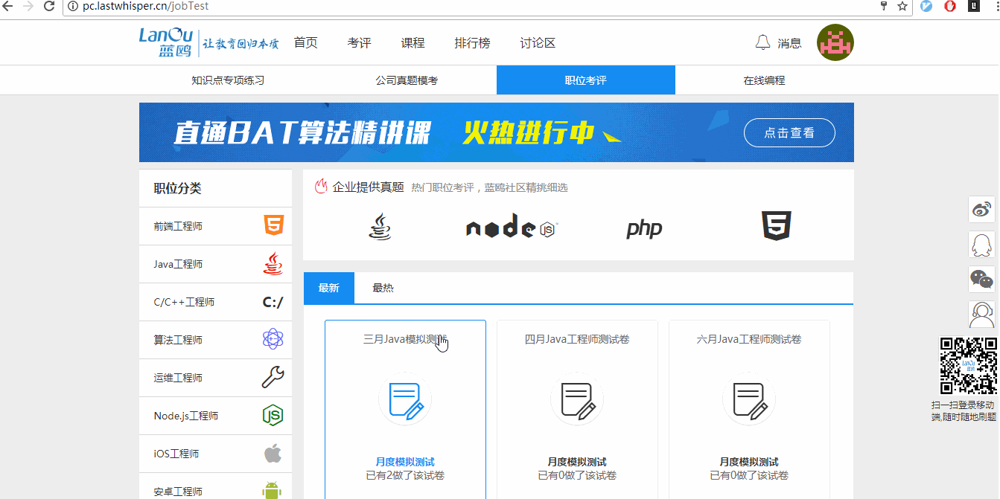
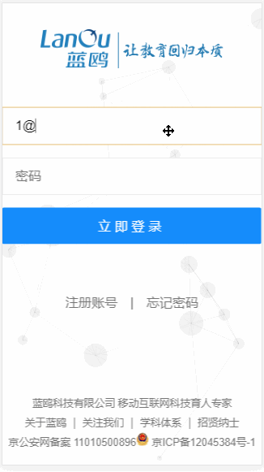
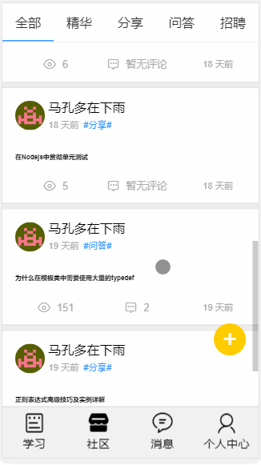

# Evaluate
因为这个项目参与了全国第八届大学生服务外包竞赛，不方便开源所以暂时放在了私人仓库里。

## Technology Stack
移动端: Vue2.0 + Vue-router + Vuex + Axios + Stylus  
PC端: stylus换成了less stylus缩进有点烦...  
后台: Express + mongodb + redis

## 截图  

## 项目反思
[一些反思心得](./Rethink.md)

## 线上地址
方便调试没build打包发布，仍然是开发模式，首屏时间超长的哇  
跪了，刚刚才发现debug模式app.js未打包有11.2M,我只额外加了element ui和echarts...
<b>免注册测试账号: 1@qq.com</b>  
<b>密码： 123  </b>  
#### 目前施工现场，顺便写了个爬虫抓题目:[请戳我](https://github.com/UnscientificMisaka/Spider)
[PC端线上运行地址http://pc.lastwhisper.cn/login](http://pc.lastwhisper.cn/login)  
移动端边学边写 烂尾了 不忍直视..自己都不想维护了除非推翻重写
[移动端线上运行地址http://lastwhisper.cn/login](http://lastwhisper.cn/login)  
请以chrome手机模式运行，没写resize事件,需要手动刷新一下根据设备dpi重新布局  
手机扫一扫  
  
[后台管理线上运行地址http://admin.lastwhisper.cn/signin](http://admin.lastwhisper.cn/signin)  

## Todo
* [x] 登录/注册/忘记密码
* [x] 邮件激活
* [x] 个人设置
* [x] 根据职业组卷，简单自由选择知识点组卷
* [x] 发题
* [x] 交卷
* [x] 分析
* [x] 社区发帖，点/取消赞，回复，加精，置顶
* [x] 后台管理，添加题目，职业,发布公共试卷，管理用户等等
* [x] 社区二级回复
* [x] 消息通知(实时消息通知没配ssl证书websocket不好推送)
* [x] 历史试卷浏览
* [x] 试题分析跟帖讨论
* [ ] 关注，取关，关注人动态推送
* [ ] 打卡机制
* [ ] 统计日月活跃用户，在线时长，监控站点，错误邮件通知等
* [ ] 知识点组卷，根据知识点，意向公司，难度，是否做过等等...(这个加上录入题目自动分析知识点准备用机器学习当毕设慢慢做...)
* [ ] 错题二级列表，知识点-错题，点击进入分析
* [ ] 更换头像

## Development  Setup
需要Node.js版本 > 6.5, 环境变量中有phantomjs, mongodb,redis服务均已开启

