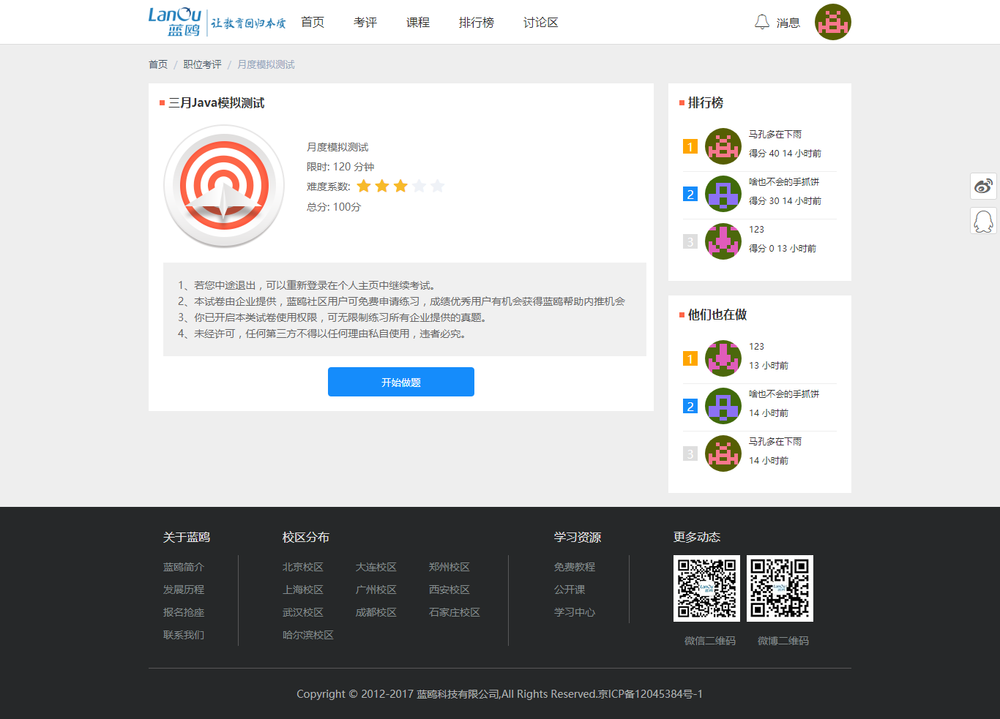

# 反思
从五一正式开始写，到今天七月十八日，两个半月左右，而PC端在移动端的基础上拓宽出来仅花了十五天，整个项目暴露出很多问题值得思考和在这些方向上继续学习。

## 后台

#### 1. 对数据库的掌握不够
+ 在几个业务场景中可以利用mongodb的populate或aggregate做一些复杂的操作,比如下面这个业务，取一份公共试卷介绍同时需要在用户做的历史试卷表中取出做这份试卷的排行榜和最近正在做的用户，排行榜取得分前十且不重复的用户，写的时候尝试用distinuct配合limit取前十，但报错不能这么用，写的有点烦了为了赶在deadline前做出来，暂时用了Promise.all再去用户表里查用户数据，这样明显很不优雅，先不说耗费时间，没有具体测过但猜测应该不如联表查询快，另一个就是mongoose这个ODM驱动库依赖自己的Schema，取出来的数据不能合并加上model里没有的字段的，我又用了Object.assign重新包装了一下，显得很臃肿。
+ 另外我觉得这些热点数据是放在redis里比较合理的，其实也就是加几十行代码的事，先去redis里查有没有没有再去mongodb里取出来放redis里设置个60秒过期时间还是多久，讨论区里的无人回复帖子倒是这样做的刚开始写的时候比较有耐心，到后面心态就毛糙起来了...  

#### 2. 整个开发流程没控制好
+ 刚刚提到Redis，事实上有个业务也因为赶时间废弃了，作为一个可以考试社区，用户账号登录的控制还是要做的，观察了一下其他社区的做法，比[牛客网](https://www.nowcoder.com)，牛客网采用了ajax短轮询，大概每隔二十秒发一个携带token的请求验证是否在其他地方登录，每三个请求后第四个请求询问是否有推送的新消息。我觉得这种短轮询每连接一次都要损耗三次握手的性能吧，不过这也要看具体后台架构方案和业务场景。但我写的后台是node.js，node.js的事件驱动方式窃以为和websocket配合是较好的，但具体数据我没测过不能妄自菲薄。每当一个用户登录上后emit登录成功事件，向redis里写登录时间，客户端标识，在线状态，token之类，断开连接时再修改。相同账号其他地方登录若redis中信息是已在线的再触发客户端强制下线提示一下于xx时间啥地方登录。原本想在此基础上拓宽一下用集合还是位图做一点聚合统计操作，日周活跃用户在线时长等等。本地调通强制下线后放到服务器上一看websocket提示400有点炸，查了一下要配ssl证书顺带还要升级nginx版本到1.9以上，捣鼓了一个晚上没搞好，就跳过了结果一直到现在聚合统计业务也没写。

#### 3. 没有遵循RESTful设计规范
+ 所有接口的请求方法清一色get,post...，并没有体现得更资源化，事实上学生对构建RESTfu服务的了解也比较少，日后改进吧。

#### 4. 关于异步编程
+ 项目中讨论区从cnode上学到了很多，一开始后台的异步是采用eventProxy这种事件发布订阅模式，后来看到cnode作者提到使用eventProxy是历史原因，建议使用Promise，其实刚开始打算用最新的async方案解决，但微博上fibjs的作者响马叔等人狂喷async让性能下滑50~100倍，小白学生党不懂底层实现比较虚，也就没有采用async,但作为要在前端圈混要紧跟潮流的，简单的学习了一下，在这个项目的题库的爬虫里实现了一些。Promise，async等等一系列在我看来都是用易维护性换性能，嵌套层级不多的小玩意直接callback就好了。不过本项目嵌套还是有点多的，就用了promise。关于promise各种规范版本又能扯一堆出来，这样下去还能不能好好开发了，老老实实用写入ES标准里的promise，中间也踩了一堆坑，看完老外的《你不知道的promise》也学到了很多，就不多提了。一坨坨链式的promise写多了也有点恶心...
附：七月前端圈撕逼还是挺厉害的，微博上跳出人撕天猫双十一的架构和winter前辈，以学生目前的水平并没有资格发表任何看法，学生也写过java，用node.js开发起来确实比java快，也不需要配置一堆xml东西，作为一名伪前端还是偏向node.js的，当然抛开具体业务场景谈技术都是耍流氓。

## 前台
#### 1. 快速开发中避免造轮子，有轮子就用
+ 吸取写后台管理的教训，在PC端开发中果断用了饿了么开源的UI组件，别人写好的轮子为啥不安在自己腿上，后台管理自己刚开始觉得量不多抄起Jquery就是干，慢慢觉得自己调css还是很烦的，虽然是一名前端工程师必备的基本能力，但同时兼顾后台觉得写css真的是超级浪费时间，当初应该找个后台管理模板套上去，没有设计稿，自己走心写的丑陋无比，还好这只是一个竞赛，并不是真正交付给用户，( 逃

#### 2. 缺乏经验
+ 移动端烂尾了，就是自己不想写了，觉得之前写的是一坨米田共，移动端的边学Vue边写的，刚开始没注重样式如何只注重各组件交互有没有搞好，还有就是缺乏移动端开发经验，虽然用了动态rem根据dpi适配，但没有设计稿找不到其他可以参考的网站，自己写的都是什么玩意,移动端首页是灾难现场，讨论区还好。
+ 另外一个缺乏经验的大坑能记住一辈子，也不能说因为缺乏经验引起的，应该是基础不够扎实，点登录按钮后跳到首页后又跳回来，后台输出了一下确认登录是放行了的，自己debug两天没找到原因，刚开始觉得这个问题太low了不好意思问其他人，而且在别人电脑上复现场景有点麻烦，最后还是去vue论坛上问了一下，前辈指出可能是button按钮语义不规范引起的，查了一下button在出IE外是被解析为submit类型的默认提交整个表单。而我只要拿到用户输入发请求并不需要form提交,删了form标签后可以了，太感激学习过程中前辈的指点了。
+ 另一个困扰很久的问题也很无语，前一段时间莫名其妙总有一会儿笔记本风扇开始狂转然后十秒后过热自动关机了。终于有一次逮到机会了赶紧开了任务管理器一看Node Service和Chrome占用超高的CPU，果断杀掉Node后，瞟了一眼控制台发现Chrome一两秒发了四千多个请求，慢慢debug发现有一个按钮的绑定事件我这样写了:@click v-bind递归绑定?(笑)

#### 3. 再谈移动端
+ 刚开始时Github上扒了一堆项目下来学习，主要两个项目源码帮助很大，一个是Vue-cnode，另一个是Vue-elm，仿饿了么的用户交互效果很棒，它的切换页面效果是建立在子路由之上的，我刚开始学习时建立项目完全没考虑到这一点，缺少组件化开发经验，哪个页面只考虑到可以复用哪些组件，压根没想到子路由之类，就是感觉整个项目都很僵硬，明显的新手玩具风格。vue版的仿饿了么数据交互全是采用fetch,它的后台基于ES6的class语法糖和import构建起来的，这些对习惯传统ajax和commonJs规范require的我都是新的冲击。
+ 还有一个有点好笑的是，处理手机打开软键盘把底部内容顶上去的问题，这个解决方案我有点羞于启齿，记录下页面的高度，当页面的高度小于记录时把底部给藏起来，高度恢复时再还原回去。还有很多兼容不同手机浏览器等等，就感觉路还很长很长。